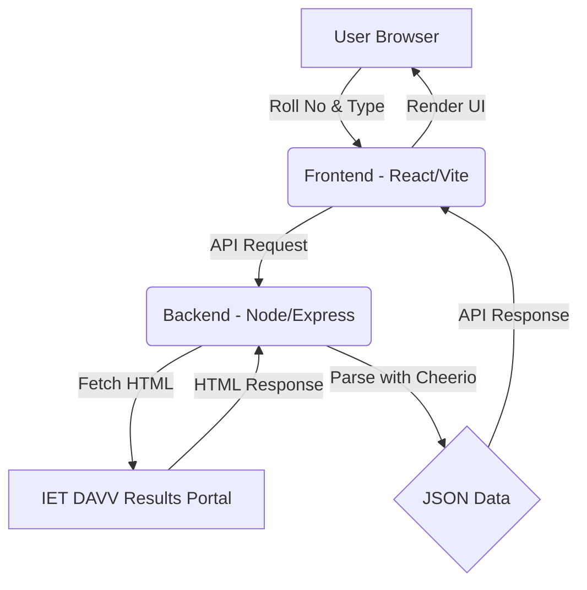

# 🎓 IET Result Viewer


A modern, fast, and user-friendly web application for viewing academic results from the **Institute of Engineering and Technology (IET), DAVV** results portal. This tool provides a cleaner UI and additional features like result card downloads, improving the overall experience of checking semester scores.

---

## 🔥 Features

- **🚀 Instant Results**: Fetches and parses data directly from the official portal in real-time.
- **📱 Responsive Design**: Fully optimized for mobile, tablet, and desktop viewing.
- **📥 Download Result**: Save your result card as an image or PDF for offline use.
- **🌓 Modern UI**: Sleek, dark-themed interface with vibrant accents and smooth animations.
- **🔍 Error Handling**: Proper validation for roll numbers and student types (Regular, EX, Elective).
- **📊 Subject-wise Breakdown**: Displays theory and practical marks separately with total SGPA and status.

---

## 🛠️ Technology Stack

### **Frontend**
- **React (Vite)**: For building a fast, component-based user interface.
- **Tailwind CSS**: For custom, utility-first styling.
- **Lucide React**: For elegant and consistent iconography.
- **html2canvas**: To enable capturing and downloading result cards.
- **Axios**: For making API requests to the backend.

### **Backend**
- **Node.js & Express**: Handling server-side logic and API routing.
- **Cheerio**: For robust HTML parsing and scraping from the official results site.
- **Axios**: To fetch data from the remote IET results server.
- **CORS**: Ensuring secure cross-origin resource sharing.

---

## 🏗️ Project Structure



---

## 🚀 Getting Started

To get a local copy up and running, follow these simple steps.

### **Prerequisites**
- [Node.js](https://nodejs.org/) (v16.x or later)
- [npm](https://www.npmjs.com/) (v7.x or later)

### **Installation**

1. **Clone the repository:**
   ```bash
   git clone https://github.com/your-username/ietresult.git
   cd ietresult
   ```

2. **Setup the Backend:**
   ```bash
   cd backend
   npm install
   npm start # Starts server on port 5000
   ```

3. **Setup the Frontend:**
   ```bash
   cd ../frontend
   npm install
   npm run dev # Starts Vite dev server
   ```

4. **Access the App:**
   Open `http://localhost:5173` in your browser.

---

## 🤝 Contributing

Contributions are what make the open-source community such an amazing place to learn, inspire, and create. Any contributions you make are **greatly appreciated**.

1. Fork the Project
2. Create your Feature Branch (`git checkout -b feature/AmazingFeature`)
3. Commit your Changes (`git commit -m 'Add some AmazingFeature'`)
4. Push to the Branch (`git push origin feature/AmazingFeature`)
5. Open a Pull Request

---

## 📝 License

Distributed under the **ISC License**. See `LICENSE` for more information.

---

## 📧 Contact

**Raman** - [@your_handle](https://twitter.com/your_handle)  
Project Link: [https://github.com/your-username/ietresult](https://github.com/your-username/ietresult)

---

> [!NOTE]
> This application is not affiliated with the Institute of Engineering and Technology (IET) or Devi Ahilya Vishwavidyalaya (DAVV). It is an independent tool designed for student convenience.